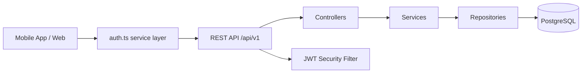
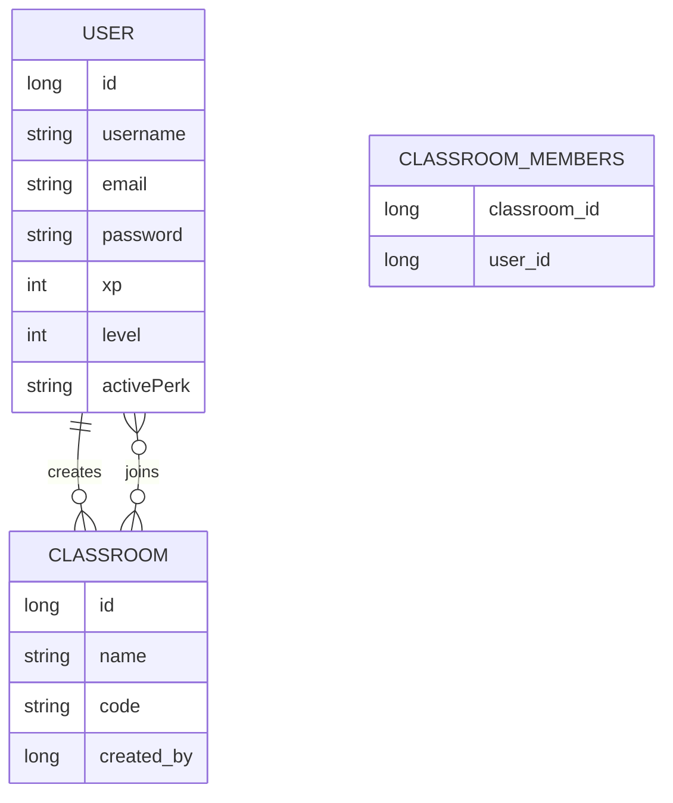

# PowerPoint за защита

Цел: 5 минути, 7-8 слайда, кратък и ясен разказ.

## Слайд 1 — Заглавие

**Math Adventure**  
Образователна игра по математика за деца

- Курсов проект по ПМУ
- Мобилно приложение с React Native (Expo) и Spring Boot backend
- Основна цел: учене чрез игра, прогрес и състезателен елемент

Говорни бележки:
- Темата на проекта е образователна игра по математика за деца.
- Основната идея е упражненията по математика да се представят като кратки игрови сесии.
- Приложението комбинира обучение, мотивация чрез XP и социален елемент чрез класации и класни стаи.

## Слайд 2 — Проблем и цел

**Проблем**

- На децата често им е трудно да поддържат интерес към рутинни математически упражнения.
- Повечето задачи се възприемат като еднообразни и без директна награда.
- Липсва бърза обратна връзка и усещане за напредък.

**Цел**

- Да се създаде мобилно приложение, което превръща решаването на математически задачи в игра.
- Да се използват кратки сесии, нива, XP, streak и перкове за мотивация.
- Да се добави състезателен елемент чрез глобална и classroom класация.

Говорни бележки:
- Проектът решава проблем с ангажираността.
- Детето не просто решава задачи, а напредва в система от нива и награди.
- Това повишава мотивацията и прави практиката по-редовна.

## Слайд 3 — Архитектура

**Техническа архитектура**

- Frontend: React Native + Expo + Expo Router + TypeScript
- Backend: Spring Boot 4 + Java 21
- База данни: PostgreSQL
- Сигурност: JWT + Spring Security
- Документация на API: Swagger / SpringDoc

Говорни бележки:
- Клиентът е реализиран с Expo, което позволява бързо мобилно разработване.
- Frontend комуникира с backend чрез REST API.
- Spring Security валидира JWT токена и допуска само оторизирани заявки към защитените ресурси.

## Слайд 4 — Модел на данните

**Основни обекти**

- `User` — username, email, password, xp, level, activePerk
- `Classroom` — name, code, createdBy
- `classroom_members` — many-to-many връзка между classroom и users

Говорни бележки:
- Всеки потребител има собствен прогрес, ниво и активен perk.
- Всяка класна стая има създател и множество членове.
- Това позволява както индивидуален прогрес, така и групово състезание.

## Слайд 5 — Основни функционалности

**Реализирани възможности**

- Регистрация и вход с JWT
- Генериране на математически въпроси с 3 нива на трудност
- Добавяне на XP и автоматично покачване на ниво
- Перкове: Hint, Shield, Double XP, Skip, Triple XP
- Глобална класация с пагинация
- Classroom система: create, join, leave, classroom leaderboard
- Двуезичен интерфейс BG/EN
- Haptic feedback в играта

Говорни бележки:
- Игровата сесия е кратка и ясна: избор на трудност, отговори, XP, запазване на прогрес.
- Перковете внасят разнообразие и стратегия.
- Classroom функционалността е важна, защото добавя общностен елемент.

## Слайд 6 — Реализация и интересни технически решения

**Backend**

- `AuthController`, `PlayerController`, `ClassroomController`
- Service слой за бизнес логиката
- Repository слой за достъп до данните
- `GlobalExceptionHandler` за централизирана обработка на грешки

**Frontend**

- `auth.ts` централизира заявките към backend и локалното съхранение
- Home screen показва progress bar, rank, streak и level-up overlay
- `game.tsx` генерира задачи процедурно според трудността
- Хаптиката подсилва обратната връзка при правилен и грешен отговор

Говорни бележки:
- Логиката е разделена по слоеве, което прави проекта по-лесен за поддръжка.
- XP и нивата се пазят и синхронизират между frontend и backend.
- Реализирана е и обработка на грешки на backend ниво, което подобрява стабилността.

## Слайд 7 — Демонстрация

**Какво ще покажа**

- Вход в приложението
- Home dashboard с ниво, XP и streak
- Стартиране на игра и решаване на няколко задачи
- Получаване на XP и обновяване на прогреса
- Отваряне на Shop и показване на perk система
- Отваряне на leaderboard и classroom leaderboard

**Визуални материали**

- Screenshot на login/register
- Screenshot на home screen
- Screenshot на game screen
- Screenshot на shop
- Screenshot на global leaderboard
- Screenshot на classrooms / classroom leaderboard

Говорни бележки:
- Демото е кратко и трябва да следва предварително подготвен сценарий.
- Най-важно е комисията да види цялата потребителска стойност, а не всеки детайл от кода.

## Слайд 8 — Заключение и бъдещо развитие

**Резултат**

- Създадено е работещо образователно приложение с backend, база данни и мобилен интерфейс.
- Проектът покрива основните изисквания за REST архитектура, ООП и мобилно приложение.
- Приложението е подходяща основа за бъдещо разширение.

**Бъдещо развитие**

- Push notifications за streak reminders
- По-силна валидация и тестове
- Offline queue и по-добра работа без връзка
- Постижения, таймер и повече режими на игра

Говорни бележки:
- Проектът е достатъчно завършен за демонстрация и защита.
- В същото време има ясни следващи стъпки за развитие и подобрение.

## Препоръка за време

| Слайд | Време |
|------|-------|
| 1 | 20-25 сек |
| 2 | 35-40 сек |
| 3 | 40-45 сек |
| 4 | 35-40 сек |
| 5 | 45 сек |
| 6 | 45 сек |
| 7 | 35 сек |
| 8 | 25-30 сек |

Общо: около 5 минути.
